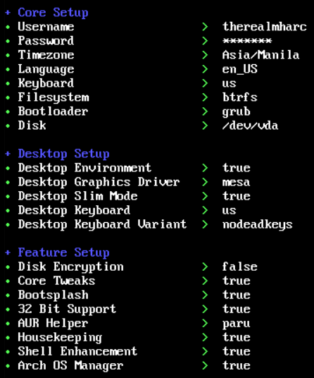

# Arch Linux Package Installer

A bash script to automate the installation of packages on Arch Linux from both official repositories and the AUR (using paru). This script is designed to be used after a minimal/slim installation of Arch Linux, such as the one from [murkl/arch-os](https://github.com/murkl/arch-os).

## Features

- Installs paru (AUR helper) if not present
- Updates the system
- Installs a curated list of packages from official repositories
- Installs a curated list of packages from the AUR
- Configures themes (Papirus icons, Bibata-Modern-Ice cursor, Adwaita shell)
- Enables User Themes extension for GNOME shell customization
- Provides option to reboot after installation

## Sample Setup

<details>
<summary>Click to view sample setup screenshot</summary>
<br>



The screenshot shows a typical configuration used with this installer script:
- Core Setup:
  - Username: therealmharc
  - Timezone: Asia/Manila
  - Language: en_US
  - Keyboard: us
  - Filesystem: btrfs
  - Bootloader: grub
  - Disk: /dev/vda

- Desktop Setup:
  - Desktop Environment: enabled
  - Desktop Graphics Driver: mesa
  - Desktop Slim Mode: enabled
  - Desktop Keyboard: us with nodeadkeys variant

- Feature Setup:
  - Core Tweaks: enabled
  - Bootsplash: enabled
  - 32 Bit Support: enabled
  - AUR Helper: paru
  - Housekeeping: enabled
  - Shell Enhancement: enabled
  - Arch OS Manager: enabled
</details>

## Usage

### One-line installation:
```bash
curl -Ls bit.ly/trm-arch-packages | bash
```

### Manual installation:
1. Clone the repository or download the script.
2. Make the script executable: `chmod +x packages.sh`
3. Run the script: `./packages.sh`

## Note

- This script should not be run as root.
- It is always recommended to review the script before running it on your system.

## Theme Configuration
After installation, the script automatically configures:
- Icons: Papirus
- Cursor: Bibata-Modern-Ice
- Shell: Adwaita (default)
- Legacy Applications: Adwaita (default)
- The script also enables the User Themes extension, allowing for further shell customization.

## Package Lists

The script installs a variety of packages including:
- Development tools (nodejs, npm, composer)
- Graphics and design (gimp, inkscape, krita)
- Utilities (android-tools, aria2, meld)
- GNOME extensions and tweaks
- And more...
